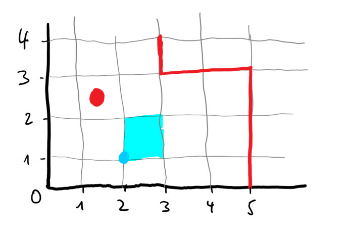
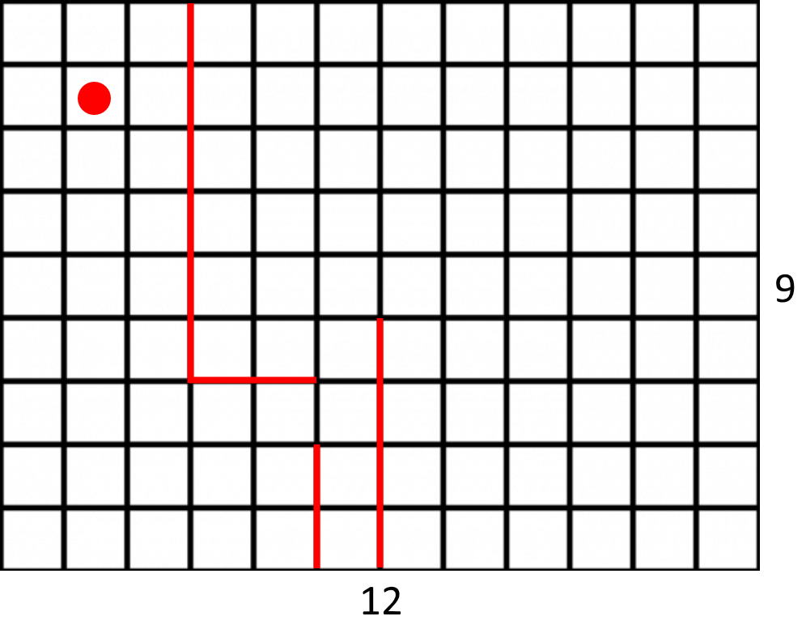

# Praktikum Softwaretechnik 2 (ST2) im SoSe 2021

Sofortiges Feedback zu Ihres Lösung finden Sie wie immer auf Ihrer individuellen Testseite:
[http://students.pages.st.archi-lab.io/st2/ss21/m0/tests/st2-praktikum_tests_group_ee87c97f-b627-4cc4-a752-2776ddf42b43]([http://students.pages.st.archi-lab.io/st2/ss21/m0/tests/st2-praktikum_tests_group_ee87c97f-b627-4cc4-a752-2776ddf42b43])

Da wir aus der Aufgabenbeschreibung direkt Coding-Aufgaben ableiten, ist die komplette Beschreibung in Englisch
gehalten. 

## Milestone 0 (M0) - Controlling a mining machine

A mining machine is used to collect minerals from a mining field, like copper, cobalt, lithium, etc. 
In milestone 0, you have the task to steer such a mining machine across a field with barriers.
The field is square-shaped. In the following image, you see a how the field is modelled as a 
system of cells.

(Please note - this is **not your personal map yet**, just a general explanation. Your personal map is further down!)



1. A **field** is divided into **cells** by an x- and y-coordinate system, each starting
 at 0. 
1. A **cell** is identified by its lower left corner. So the blue cell depicted here has the coordinate **(2,1)**. 
1. The field contains **barriers**, depicted as red lines. The barriers run only horizontally or
    vertically. They may be connected to each other. A barrier is identified by its start- and 
    end coordinate. So, in the above image you see three barriers: 
    * (5,0)-(5,3)
    * (3,3)-(5,3)
    * (3,3)-(3,4)
1. In addition, field boundaries cannot be passed - essentially they also are a kind of barrier.
1. The **mining machine** initially is located in the cell indicated by the red dot. In the above case this is 
    **(1,2)**.  
1. The mining machine can be moved by a simple set of commands. A command is enclosed by square brackets, and 
    has two parts: a direction and the number of steps. A mining machine can only be moved horizontally or 
    vertically, not diagonally. 
    * If the command is e.g. **[no,2]**, the mining machine moves 2 cells up, and is then positioned 
        on **(1,4)**.
    * The direction is either **no** (north), **ea** (east), **so** (south), or **we** (west).    
1. If the mining machine meets a barrier or a field boundary, then it moves only as 
    many steps as possibly, and then stops. Let's make an example: 
    * At the beginning, the mining machine is at (1,2), as depicted.
    * The first command is [no,1]. The mining machine is at (1,3). 
    * The next command is [ea,3]. But the mining machine can only be moved by one step, and stops at (2,3).
    * The next command is [so,7]. The mining machine can be moved by 3 steps, and stops at (2,0).
    * The next command is again [ea,3]. This time, the mining machine can be moved by 2 steps, and stops at (4,0).

## Your task in milestone 0

This is your personal map of the field. You see the dimensions of it. The mining machine is at (1,7).



Please implement `thkoeln.st.st2praktikum.exercise.Exercise0`. It basically means that you have to implement one 
simple interface: 

```java
public interface Moveable {
    String move(String moveCommandString);
}
```

The string parameter `moveCommandString` has the same format as shown above (e.g. "`[no,2]`"). The expexted return
value is the coordinate where the mining machine is afterwards, in the format as above (e.g. "`(2,4)`").

A word of warning: You find two visible unit tests in your repo. Just hardcoding the expected results won't work, 
since we have some hidded tests as well - and you won't be told the commands of those. So, you might have to add
own tests and start debugging, should the hidden tests keep failing.